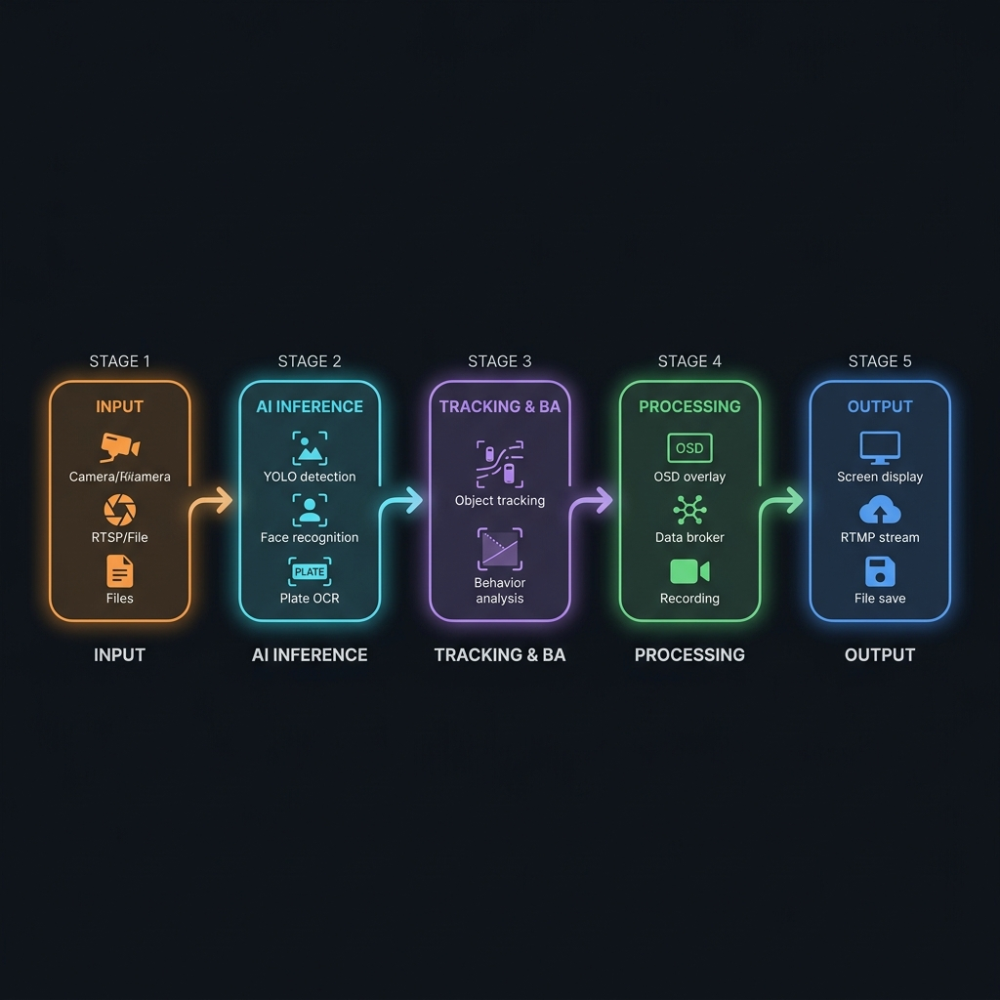
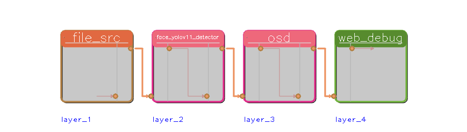
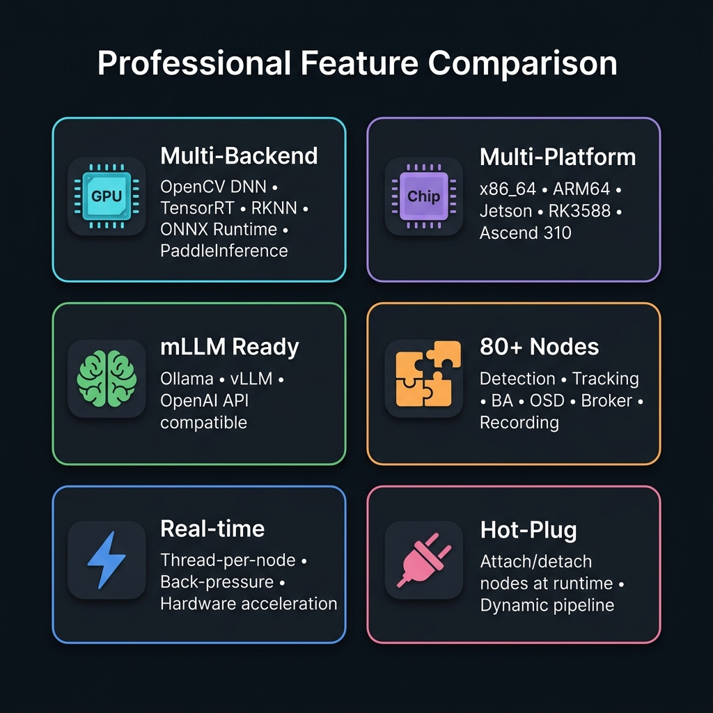
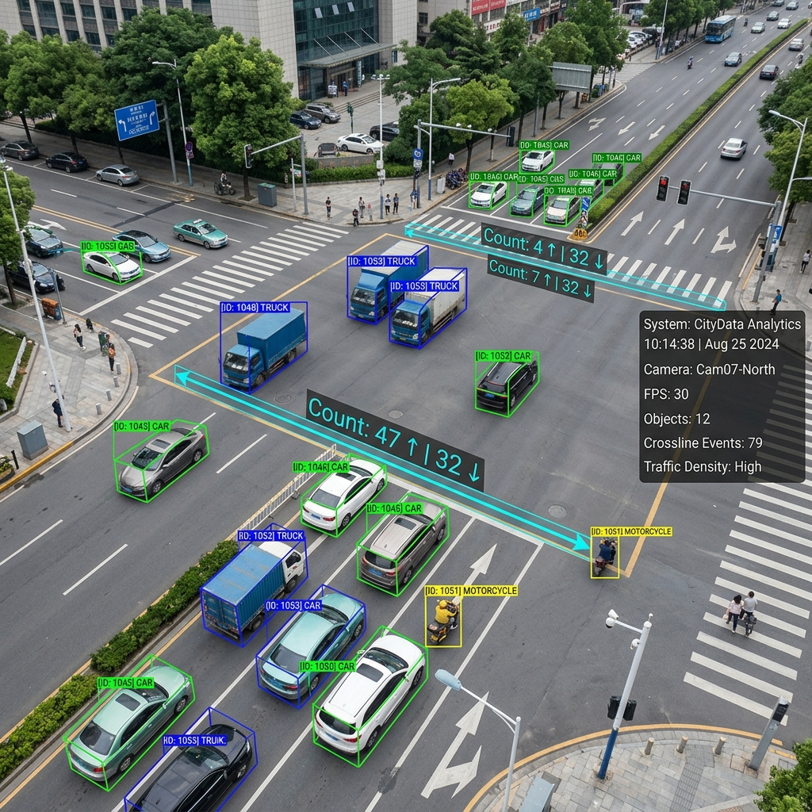

<p align="center">
  
</p>

<h1 align="center">OmniCore — AI Video Analytics SDK</h1>

<p align="center">
  <strong>Build real-time video analytics pipelines with plug-and-play AI nodes.</strong><br>
  Run on GPU, NPU, and CPU — across x86_64 and ARM64 edge devices with a few lines of C++.
</p>

<p align="center">
  <a href="#-quick-start">Quick Start</a> •
  <a href="#-features--comparisons">Features</a> •
  <a href="./docs/ARCHITECTURE.md">Architecture</a> •
  <a href="./docs/DEVELOPMENT.md">Development</a> •
  <a href="./docs/NODES_AND_SAMPLES.md">Nodes & Samples</a> •
  <a href="#-documentation">Docs</a> •
  <a href="#-license">License</a>
</p>

---

OmniCore (internal: **EdgeOS SDK / AI Core Runtime**) is a high-performance, plugin-based C++17 framework for building real-time video analytics applications. Each processing unit — called a **Node** — is an independent plugin that can be freely combined to construct diverse pipelines: from simple object detection to complex multi-channel traffic violation systems with behavior analysis, face recognition, license plate reading, and mLLM integration.

> ⭐ **Star this repo** to keep up with new node releases, model integrations, and platform support.

<p align="center">
  
</p>

## 🏆 Why OmniCore?

| | OmniCore | NVIDIA DeepStream | Huawei mxVision |
|---|---|---|---|
| **Ease of use** | ✅ Simple C++ API | ⚠️ Complex GStreamer config | ⚠️ Ascend-only toolchain |
| **Multi-backend** | ✅ OpenCV DNN / TensorRT / RKNN / ONNX RT / PaddleInference / mLLM | ⚠️ TensorRT only | ⚠️ Ascend ACL only |
| **Multi-platform** | ✅ x86_64 + ARM64 (Jetson, RK3588, Ascend) | ⚠️ NVIDIA only | ⚠️ Huawei only |
| **mLLM support** | ✅ Ollama / vLLM / OpenAI API | ❌ | ❌ |
| **Plugin composability** | ✅ Attach/detach nodes at runtime | ⚠️ Static pipeline | ⚠️ Static pipeline |
| **Minimal dependencies** | ✅ C++17 + OpenCV | ⚠️ Heavy NVIDIA stack | ⚠️ Heavy Ascend stack |

---

## 🚀 Quick Start

<table>
<tr>
<td width="50%">

### 📦 Install Dependencies

```bash
# Interactive (asks about optional deps)
make setup

# Non-interactive (base deps only)
make setup-auto
```

</td>
<td width="50%">

### 🔨 Build

```bash
# Auto-detect hardware
make build

# Or target specific platform
make build-cpu
make build-rockchip
```

</td>
</tr>
</table>

### Minimal Example — Face Detection Pipeline

```cpp
#include <cvedix/nodes/src/cvedix_file_src_node.h>
#include <cvedix/nodes/infers/cvedix_yunet_face_detector_node.h>
#include <cvedix/utils/analysis_board/cvedix_analysis_board.h>

int main() {
    CVEDIX_LOGGER_INIT();

    // 1. Create nodes
    auto source   = std::make_shared<cvedix_nodes::cvedix_file_src_node>("src", 0, "video.mp4", 1.0);
    auto detector = std::make_shared<cvedix_nodes::cvedix_yunet_face_detector_node>("det", "face_detection_yunet.onnx");

    // 2. Build pipeline
    detector->attach_to({source});

    // 3. Run
    source->start();

    // 4. Debug visualizer (FPS, latency, queue stats)
    cvedix_utils::cvedix_analysis_board board({source});
    board.display();

    return 0;
}
```

<p align="center">
  
  <br><em>Analysis Board: real-time FPS, latency, and queue monitoring for every node</em>
</p>

### SDK Integration (CMake)

After installing the `.deb` package:

```cmake
find_package(cvedix REQUIRED)
target_link_libraries(my_app PRIVATE cvedix::cvedix_instance_sdk)
```

---

## ⚙️ Features & Comparisons

<p align="center">
  
</p>

Legend: ✅ Supported  |  ⚠️ Partial  |  ❌ Not available

### Pipeline Capabilities

| Feature | Status | Description |
|---------|--------|-------------|
| Stream Input | ✅ | RTSP, RTMP, UDP, File, Image, Application |
| Video Decode | ✅ | OpenCV/GStreamer + HW acceleration (NVDEC) |
| AI Inference | ✅ | Multi-stage deep learning (detect → classify → extract) |
| mLLM Integration | ✅ | Ollama, vLLM, OpenAI-compatible APIs |
| Object Tracking | ✅ | SORT, ByteTrack, OC-SORT, DeepSORT, BoTSORT |
| Behavior Analysis | ✅ | 22+ rules (crossline, wrong-way, red-light, speed, crowding…) |
| On-Screen Display | ✅ | Draw results on frames (bbox, skeleton, plate text…) |
| Data Broker | ✅ | MQTT, Kafka, SSE, UDP Socket, Console, XML |
| Recording | ✅ | Video/image recording with event triggers |
| Stream Output | ✅ | RTSP, RTMP, File, Screen, Application |
| Multi-Channel | ✅ | Share or isolate nodes across channels |
| Dynamic Pipeline | ✅ | Hot-plug nodes at runtime (attach/detach) |

### Inference Backends

| Backend | Platform | Hardware | Status |
|---------|----------|----------|--------|
| OpenCV DNN | All | CPU / GPU | ✅ Default |
| TensorRT | NVIDIA | GPU (RTX/Tesla/Jetson) | ✅ |
| RKNN | Rockchip | NPU (RK3588) | ✅ |
| PaddleInference | All | CPU / GPU | ✅ OCR |
| ONNX Runtime | All | CPU / GPU | ✅ |
| mLLM (Ollama/vLLM) | All | CPU / GPU | ✅ |

### Supported Platforms

| Platform | Architecture | Hardware | Status |
|----------|-------------|----------|--------|
| Ubuntu 18.04+ | x86_64 | NVIDIA RTX/Tesla GPUs | ✅ Tested |
| Ubuntu 18.04+ | aarch64 | NVIDIA Jetson (TX2+) | ✅ Tested |
| Ubuntu 22.04+ | x86_64 | CPU-only (VMware/bare metal) | ✅ Tested |
| Ubuntu 18.04+ | aarch64 | Rockchip RK3588 NPU | ✅ Tested |
| Ubuntu 22.04+ | aarch64 | Ascend 310/910 | ✅ Tested |

---

## 🧩 Node Catalog

<p align="center">
  
  <br><em>Real-time traffic analytics: vehicle detection, tracking, crossline counting & behavior analysis</em>
</p>

OmniCore ships **80+ ready-to-use nodes** across 12 categories:

<table>
<tr>
<td>

**🎬 Source** (6 nodes)
- File, RTSP, RTMP, UDP
- Image, Application

</td>
<td>

**🧠 Inference** (35+ nodes)
- YOLO (v3/v8/v11), YuNet
- InsightFace, SFace, FaceNet
- PaddleOCR, OpenPose
- mLLM, CLIP, Real-ESRGAN

</td>
<td>

**🏃 Tracking** (5 algorithms)
- SORT, ByteTrack
- OC-SORT, DeepSORT
- BoTSORT

</td>
</tr>
<tr>
<td>

**📊 Behavior Analysis** (22+ rules)
- Crossline counting
- Wrong-way, red-light
- Speed estimation
- Crowding, loitering
- Area enter/exit
- Lane & parking violation

</td>
<td>

**📤 Broker** (13 nodes)
- MQTT, Kafka, SSE
- UDP Socket, Console
- XML File / Socket
- Webhook

</td>
<td>

**🖥️ Output** (7 nodes)
- Screen, File, RTMP
- RTSP (self-hosted)
- Image, Application
- Fake (benchmarking)

</td>
</tr>
<tr>
<td>

**🎨 OSD** (18 nodes)
- Detection, Face, Plate
- Pose, Segmentation
- BA results overlay
- mLLM description

</td>
<td>

**🔀 Middleware** (6 nodes)
- Split (by channel / deep-copy)
- Sync, Skip, Placeholder
- Custom transform

</td>
<td>

**📹 Record** (1 node)
- Video & image recording
- Event-triggered capture
- Completion hooks

</td>
</tr>
</table>

> 📖 Full node reference: [**docs/NODES_AND_SAMPLES.md**](./docs/NODES_AND_SAMPLES.md)

---

## 🧪 60+ Sample Programs

Pre-built examples covering every use case:

| Category | Samples | Key Examples |
|----------|---------|-------------|
| **Pipeline Topology** | 6 | `1-1-1`, `1-N-N`, `N-1-N` multi-channel |
| **Face Detection & Recognition** | 17 | YuNet, InsightFace, FaceNet, face swap |
| **Behavior Analysis** | 11 | Crossline, wrong-way, speed, crowding |
| **Vehicle & Plate** | 11 | Plate recognition, ByteTrack+OCR |
| **Object Detection** | 10 | YOLOv11, Mask R-CNN, fire/smoke |
| **TensorRT** | 6 | YOLOv8/v11 GPU acceleration |
| **Rockchip RKNN** | 9 | RK3588 NPU inference |
| **Message Broker** | 5 | MQTT, Kafka, SSE |
| **Utility** | 13 | Dynamic pipeline, recording, mLLM |

```bash
# Build and run a sample
make build
./build/samples/ba_crossline_sample
```

> 📖 Sample guide: [**samples/README.md**](./samples/README.md)

---

## 📖 Documentation

| Document | Description |
|----------|-------------|
| [**Architecture Guide**](./docs/ARCHITECTURE.md) | Pipeline architecture, node internals, data model, class hierarchy |
| [**Development Guide**](./docs/DEVELOPMENT.md) | Developer setup, backend builds, samples, node workflow, troubleshooting |
| [**Nodes & Samples Reference**](./docs/NODES_AND_SAMPLES.md) | Complete API reference for all 80+ nodes and 60+ samples |
| [**BA Crossline Usage**](./docs/BA_CROSSLINE_USAGE.md) | Crossline counting configuration guide |
| [**BA Event Format**](./docs/BA_NODE_EVENT_FORMAT.md) | Behavior analysis event JSON/XML format |
| [**BA Event Extraction**](./docs/BA_EVENT_EXTRACTION_INTEGRATION.md) | Integration guide for BA event extraction |
| [**Face Recognition (SeetaFace6)**](./docs/FACE_RECOGNIZER_SEETAFACE6.md) | SeetaFace6 face recognizer setup |
| [**Face Recognition Benchmark**](./docs/FACE_RECOGNITION_BENCHMARK_REPORT.txt) | Performance benchmark results |

---

## 📦 Build & Deployment

### Make Commands

| Command | Description |
|---------|-------------|
| `make setup` | Install dependencies (auto-detect hardware) |
| `make setup-auto` | Install base dependencies (non-interactive) |
| `make build` | Build with auto-detect hardware |
| `make build-cpu` | Build for CPU only |
| `make build-nvidia-openvino-ort` | Build with NVIDIA CUDA/TensorRT + OpenVINO + ONNX Runtime |
| `make build-rockchip` | Build for Rockchip RK35xx |
| `make package-cpu` | Create `.deb` package for CPU |
| `make package-rockchip` | Create `.deb` package for Rockchip |
| `make info` | Show detected hardware info |
| `make clean` | Clean build directories |

### Package Installation

```bash
# Install SDK package
sudo dpkg -i libcvedix-dev_*.deb

# Verify
pkg-config --modversion cvedix
```

### Deployment Options

| Method | Description |
|--------|-------------|
| **`.deb` Package** | SDK + runtime + models for Debian/Ubuntu |
| **Docker** | Minimal container image with `.deb` base |
| **systemd Service** | Run as background service with auto-restart |

---

## 🔧 Requirements

### Base Requirements

| Requirement | Version |
|-------------|---------|
| C++ Standard | C++20 |
| Compiler | GCC ≥ 7.5 |
| OpenCV | ≥ 4.6 |
| GStreamer | 1.14.5 (required by OpenCV) |

### Optional (per inference backend)

| Backend | Dependency | Install Guide |
|---------|-----------|---------------|
| TensorRT | CUDA + TensorRT | [Guide](./third_party/trt_vehicle/README.md) |
| PaddleInference | Paddle Inference | [Guide](./third_party/paddle_ocr/README.md) |
| ONNX Runtime | ONNX Runtime | — |
| RKNN | RKNN Toolkit | — |
| mLLM | Ollama / vLLM / OpenAI API | — |

---

## 🙏 Acknowledgements

We would like to thank the following projects:

- [OpenCV](https://github.com/opencv/opencv) — Computer vision library
- [GStreamer](https://gstreamer.freedesktop.org/) — Multimedia framework
- [ONNX Runtime](https://github.com/microsoft/onnxruntime) — Cross-platform inference
- [PaddleOCR](https://github.com/PaddlePaddle/PaddleOCR) — OCR toolkit
- [ByteTrack](https://github.com/ifzhang/ByteTrack) — Multi-object tracking
- [YOLOv11](https://github.com/ultralytics/ultralytics) — Object detection

---

## 📄 License

OmniCore is proprietary software developed by **CVEDIX**.

- **SDK License**: Requires a valid license key for production deployment.
- **Evaluation**: Contact us for evaluation access.

---

## 🤝 Contact & Support

Have questions, feature requests, or need enterprise support?

- 📧 **Email**: [contact@cvedix.com](mailto:contact@cvedix.com)
- 🐛 **Issues**: [Submit an issue](https://github.com/CVEDIX/omnicore/issues) on GitHub
- 📖 **Docs**: [Architecture Guide](./docs/ARCHITECTURE.md) | [Nodes & Samples](./docs/NODES_AND_SAMPLES.md)
