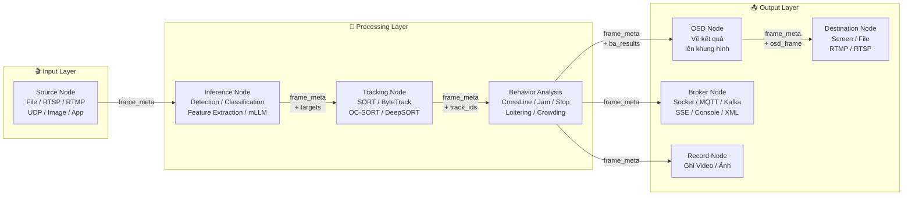
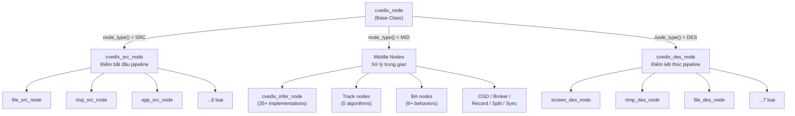
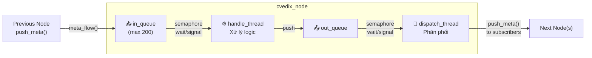
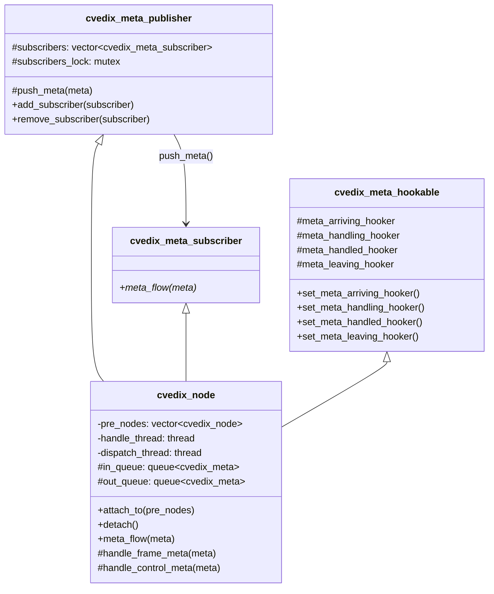
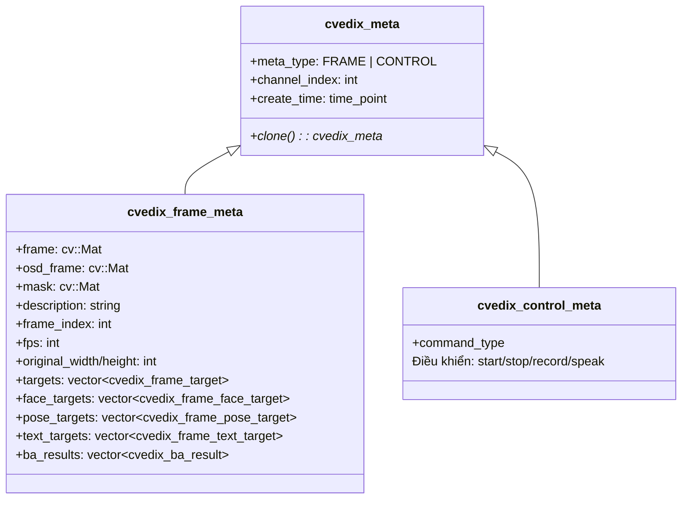
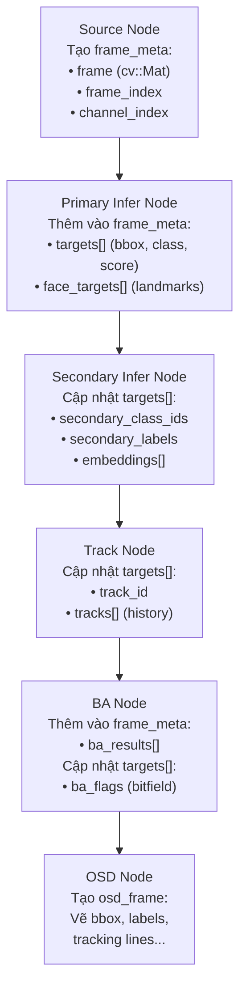
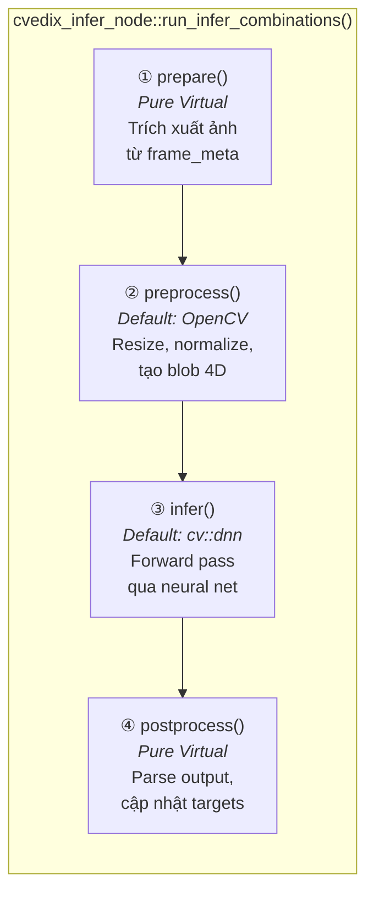
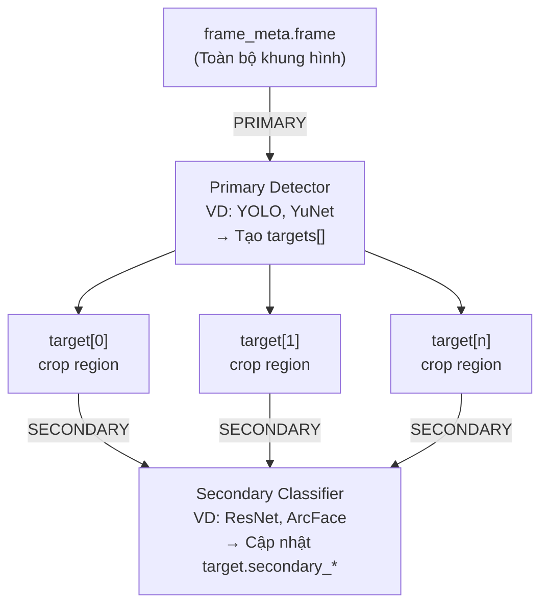

# Kiến trúc EdgeOS SDK (AI Core Runtime)

## 1. Tổng quan

**EdgeOS SDK** (tên nội bộ: **AI Core Runtime / cvedix**) là một framework phân tích video thời gian thực viết bằng **C++17**. Framework hoạt động theo mô hình **pipeline dựa trên plugin**, trong đó mỗi thành phần xử lý (gọi là **Node**) là một đơn vị độc lập, có thể kết nối tự do để xây dựng các ứng dụng phân tích video đa dạng.

### Triết lý thiết kế

| Nguyên tắc | Mô tả |
|------------|--------|
| **Plugin-based** | Mỗi Node là một plugin độc lập, có thể tổ hợp tùy ý |
| **Multi-backend** | Hỗ trợ nhiều inference backend (OpenCV DNN, TensorRT, RKNN, ONNX Runtime, mLLM) |
| **Multi-platform** | Chạy trên x86_64/aarch64, NVIDIA GPU/Jetson, Rockchip RK3588, Ascend 310/910 |
| **Thread-per-node** | Mỗi Node chạy trên thread riêng, đảm bảo xử lý song song |
| **Observable** | Hệ thống hook 4 điểm cho phép giám sát realtime tại mọi Node |

---

## 2. Kiến trúc tổng thể

### 2.1 Sơ đồ Pipeline

Dữ liệu chảy từ trái sang phải qua các Node, mỗi Node xử lý và chuyển tiếp metadata:



### 2.2 Ví dụ Pipeline thực tế

```
Pipeline phát hiện khuôn mặt + theo dõi + ghi nhận sự kiện:

file_src_0 ──→ yunet_face_detector ──→ sort_tracker ──→ ba_crossline ──┬──→ face_osd ──→ rtsp_des_0
                                                                        ├──→ mqtt_broker
                                                                        └──→ record_node
```

```
Multi-channel pipeline với chia sẻ detector:

rtsp_src_0 ─┐                                               ┌──→ tracker_0 ──→ osd_0 ──→ screen_des_0
             ├──→ yolo_detector ──→ split(by channel) ──┤
rtsp_src_1 ─┘                                               └──→ tracker_1 ──→ osd_1 ──→ screen_des_1
```

---

## 3. Kiến trúc Node (Lõi Framework)

### 3.1 Phân loại Node

Mọi Node trong framework đều kế thừa từ lớp cơ sở `cvedix_node` và được phân thành 3 loại:



| Loại | Enum | Đặc điểm | Ràng buộc |
|------|------|-----------|-----------|
| **SRC** | `cvedix_node_type::SRC` | Tạo dữ liệu, khởi tạo pipeline | Không có node trước (`attach_to()` bị cấm) |
| **MID** | `cvedix_node_type::MID` | Xử lý, biến đổi, phân tích dữ liệu | Có cả node trước và node sau |
| **DES** | `cvedix_node_type::DES` | Tiêu thụ dữ liệu, xuất kết quả | Không có node sau (`dispatch_run()` bị vô hiệu hóa) |

### 3.2 Cơ chế hoạt động bên trong Node

Mỗi Node sử dụng **2 thread** và **2 queue** kết nối qua semaphore:



#### Luồng xử lý chi tiết (handle_thread):

```
1. wait(in_queue_semaphore)         // Chờ dữ liệu
2. meta = in_queue.front()          // Lấy meta
3. IF meta.type == FRAME:
      result = handle_frame_meta(meta)     // Xử lý frame
   ELIF meta.type == CONTROL:
      result = handle_control_meta(meta)   // Xử lý lệnh điều khiển
4. in_queue.pop()
5. IF result != nullptr && node_type != DES:
      out_queue.push(result)        // Đẩy sang dispatch
      signal(out_queue_semaphore)
```

#### Cơ chế Back-pressure:

Khi `in_queue` đầy (> `max_in_queue_size` = 200), meta mới bị **drop** kèm warning log. Điều này ngăn chặn memory leak khi downstream xử lý chậm hơn upstream.

### 3.3 Publisher/Subscriber Pattern

Kết nối giữa các Node dựa trên mô hình **Publish/Subscribe**:



**Kết nối pipeline** sử dụng `attach_to()`:

```cpp
// Node B nhận dữ liệu từ Node A
node_b->attach_to({node_a});
// Tương đương: node_a.add_subscriber(node_b)
//              node_b.pre_nodes.push_back(node_a)

// Fan-out: Nhiều node nhận từ cùng một nguồn
osd->attach_to({detector});
broker->attach_to({detector});
record->attach_to({detector});

// Fan-in: Một node nhận từ nhiều nguồn
detector->attach_to({src_0, src_1, src_2});
```

### 3.4 Hệ thống Hook (Observability)

Mỗi Node có **4 điểm hook** (port) cho phép giám sát luồng dữ liệu realtime:

```
                    ┌──────────────── cvedix_node ────────────────┐
                    │                                             │
  meta_flow() ──→  │ ① Arriving ──→ ② Handling ──→ ③ Handled ──→ │ ──→ ④ Leaving ──→ push_meta()
                    │  (in_queue)    (processing)   (out_queue)   │     (dispatch)
                    └─────────────────────────────────────────────┘
```

| Port | Tên Hook | Thời điểm kích hoạt |
|------|----------|---------------------|
| ① | `meta_arriving_hooker` | Meta được push vào `in_queue` |
| ② | `meta_handling_hooker` | Meta được pop ra để xử lý |
| ③ | `meta_handled_hooker` | Meta xử lý xong, push vào `out_queue` |
| ④ | `meta_leaving_hooker` | Meta được dispatch sang node tiếp theo |

**Ứng dụng**: `cvedix_analysis_board` sử dụng hook system để tính **FPS**, **latency**, **queue size** tại từng node trong pipeline.

---

## 4. Mô hình Dữ liệu (Data Model)

### 4.1 Hệ thống phân cấp Metadata

Dữ liệu chảy qua pipeline dưới dạng các đối tượng `cvedix_meta`:



### 4.2 Cấu trúc Target (Đối tượng Phát hiện)

Mỗi đối tượng phát hiện trong frame được biểu diễn bởi `cvedix_frame_target`:

```
cvedix_frame_target
├── Vị trí: x, y, width, height
├── Primary Inference:
│   ├── primary_class_id      // ID lớp (từ detector)
│   ├── primary_score          // Độ tin cậy
│   └── primary_label          // Nhãn ("car", "person"...)
├── Secondary Inference:
│   ├── secondary_class_ids[]  // Từ classifier nodes
│   ├── secondary_scores[]
│   └── secondary_labels[]     // ("red", "sedan"...)
├── Tracking:
│   ├── track_id               // ID theo dõi (từ tracker)
│   └── tracks[]               // Lịch sử vị trí các frame trước
├── Feature Vector:
│   └── embeddings[]           // 128/256-dims (cho ReID)
├── Instance Segmentation:
│   └── mask: cv::Mat          // Mask pixel-level
├── Sub-targets:
│   └── sub_targets[]          // Đối tượng con (biển số trong xe)
└── Behavior Analysis:
    └── ba_flags: int          // Bitfield flags (0100 = "Stop")
```

### 4.3 Luồng dữ liệu qua Pipeline

Dữ liệu được **enriched** (bổ sung thông tin) khi chảy qua từng Node:



---

## 5. Kiến trúc Inference (Suy luận AI)

### 5.1 Inference Pipeline 4 bước

Mọi inference node đều tuân theo **chuẩn 4 bước** được định nghĩa trong `cvedix_infer_node`:



| Bước | Method | Implementation | Customizable? |
|------|--------|----------------|---------------|
| ① Prepare | `prepare()` | **Pure virtual** | Bắt buộc override |
| ② Preprocess | `preprocess()` | Default (blob + normalize) | Tùy chọn override |
| ③ Infer | `infer()` | Default (OpenCV DNN forward) | Override cho TRT/RKNN/ONNX |
| ④ Postprocess | `postprocess()` | **Pure virtual** | Bắt buộc override |

### 5.2 Primary vs Secondary Inference



- **Primary**: Suy luận trên **toàn bộ frame** → tạo danh sách targets mới
- **Secondary**: Suy luận trên **từng target crop** → bổ sung thông tin vào target có sẵn

### 5.3 Inference Backend hỗ trợ

| Backend | Base Class | Khi nào dùng | Platform |
|---------|-----------|-------------|----------|
| **OpenCV DNN** | `cvedix_infer_node` | Mặc định, đa nền tảng | Tất cả |
| **TensorRT** | `cvedix_trt_*` | GPU NVIDIA, hiệu suất cao | NVIDIA GPU/Jetson |
| **RKNN** | `cvedix_rknn_*` | NPU Rockchip | RK3588 |
| **PaddleInference** | `cvedix_ppocr_*` | OCR (PaddleOCR) | x86_64/aarch64 |
| **ONNX Runtime** | `cvedix_*_ort_*` | Cross-platform, ONNX models | Tất cả |
| **mLLM** | `cvedix_mllm_*` | Mô hình ngôn ngữ lớn | Ollama/vLLM/OpenAI API |

---

## 6. Phân cấp lớp đầy đủ (Class Hierarchy)

```mermaid
classDiagram
    class cvedix_node {
        <<abstract>>
        #alive: bool
        #in_queue / out_queue
        #handle_run()
        #dispatch_run()
        +attach_to() / detach()
        +meta_flow()
        #handle_frame_meta()
        #handle_control_meta()
    }
    
    class cvedix_src_node {
        <<abstract>>
        #channel_index: int
        #gate: cvedix_gate
        +start() / stop()
    }
    
    class cvedix_des_node {
        <<abstract>>
        +channel_index: int
        -fps counter
    }
    
    class cvedix_infer_node {
        <<abstract>>
        #net: cv::dnn::Net
        #prepare()*
        #preprocess()
        #infer()
        #postprocess()*
    }
    
    cvedix_node <|-- cvedix_src_node
    cvedix_node <|-- cvedix_des_node
    cvedix_node <|-- cvedix_infer_node
    
    cvedix_src_node <|-- cvedix_file_src_node
    cvedix_src_node <|-- cvedix_rtsp_src_node
    cvedix_src_node <|-- cvedix_rtmp_src_node
    cvedix_src_node <|-- cvedix_udp_src_node
    cvedix_src_node <|-- cvedix_image_src_node
    cvedix_src_node <|-- cvedix_app_src_node
    
    cvedix_des_node <|-- cvedix_screen_des_node
    cvedix_des_node <|-- cvedix_file_des_node
    cvedix_des_node <|-- cvedix_rtmp_des_node
    cvedix_des_node <|-- cvedix_rtsp_des_node
    cvedix_des_node <|-- cvedix_image_des_node
    cvedix_des_node <|-- cvedix_app_des_node
    cvedix_des_node <|-- cvedix_fake_des_node
    
    class cvedix_primary_infer_node {
        <<abstract>>
    }
    class cvedix_secondary_infer_node {
        <<abstract>>
    }
    
    cvedix_infer_node <|-- cvedix_primary_infer_node
    cvedix_infer_node <|-- cvedix_secondary_infer_node
    
    cvedix_primary_infer_node <|-- cvedix_yolo_detector_node
    cvedix_primary_infer_node <|-- cvedix_yunet_face_detector_node
    cvedix_primary_infer_node <|-- cvedix_yolov11_detector_node
    cvedix_primary_infer_node <|-- cvedix_openpose_detector_node
    cvedix_primary_infer_node <|-- cvedix_mllm_analyser_node
    
    cvedix_secondary_infer_node <|-- cvedix_classifier_node
    cvedix_secondary_infer_node <|-- cvedix_feature_encoder_node
    cvedix_secondary_infer_node <|-- cvedix_sface_feature_encoder_node

    cvedix_node <|-- cvedix_track_node
    cvedix_node <|-- cvedix_ba_crossline_node
    cvedix_node <|-- cvedix_osd_node
    cvedix_node <|-- cvedix_msg_broker_node
    cvedix_node <|-- cvedix_record_node
    cvedix_node <|-- cvedix_split_node
    cvedix_node <|-- cvedix_sync_node
    
    cvedix_track_node <|-- cvedix_sort_track_node
    cvedix_track_node <|-- cvedix_bytetrack_node
    cvedix_track_node <|-- cvedix_ocsort_track_node
```



---

## 7. Quản lý Vòng đời Pipeline

### 7.1 Khởi tạo

```cpp
// 1. Tạo instance (constructor gọi initialized() → khởi chạy 2 thread)
auto src = std::make_shared<cvedix_file_src_node>("src", 0, "video.mp4");
auto det = std::make_shared<cvedix_yolo_detector_node>("det", ...);
auto des = std::make_shared<cvedix_screen_des_node>("des", 0);

// 2. Kết nối pipeline (pub/sub)
det->attach_to({src});
des->attach_to({det});

// 3. Bắt đầu (mở gate ở source node)
src->start();
```

### 7.2 Xử lý realtime

```
src (Thread)              det (Thread)              des (Thread)
    │                         │                         │
    ├─ Đọc frame          │                         │
    ├─ Tạo frame_meta     │                         │
    ├─ push_meta()────────→├─ meta_flow()           │
    │                      ├─ handle_frame_meta()   │
    │                      ├─ Detect objects         │
    │                      ├─ Thêm targets[]         │
    │                      ├─ push_meta()────────────→├─ meta_flow()
    │                      │                          ├─ Render to screen
    ...                    ...                        ...
```

### 7.3 Hủy / Dừng

```cpp
// Dừng source (đóng gate)
src->stop();       // → gửi control_meta(STOP) xuống pipeline

// Hoặc hủy pipeline
src.reset();       // → destructor → deinitialized() → alive=false
                   //   → push nullptr (dead flag) → join threads
```

**Dead Signal Propagation**: Khi source ngừng, nó push `nullptr` vào queue, signal này truyền qua toàn bộ pipeline để dừng tất cả thread.

---

## 8. Hệ thống Multi-Channel

Framework hỗ trợ xử lý **nhiều kênh video đồng thời**:

```
Mô hình 1: Chia sẻ node xử lý (hiệu suất thấp hơn, tiết kiệm tài nguyên):

src_ch0 ─┐                                           ┌─→ osd_ch0 → des_ch0
          ├─→ detector ──→ tracker ──→ split_node ──┤
src_ch1 ─┘                                           └─→ osd_ch1 → des_ch1


Mô hình 2: Node riêng biệt per-channel (hiệu suất cao hơn, tốn tài nguyên):

src_ch0 ─┐              ┌─→ tracker_0 ──→ osd_ch0 → des_ch0
          ├─→ detector ──┤
src_ch1 ─┘              └─→ tracker_1 ──→ osd_ch1 → des_ch1
```

- **Source/Destination**: Luôn gắn với một `channel_index` cố định
- **Infer/Broker**: Hỗ trợ multi-channel mặc định (xử lý mọi channel)
- **Track/BA**: Tùy chọn — dùng `std::map<int, ...>` để phân biệt channels

---

## 9. Cấu trúc Thư mục Mã nguồn

```
edgeos-sdk/
├── nodes/                          # ⭐ Plugin Nodes (~302 files)
│   ├── common/                     #   Lớp cơ sở (cvedix_node, src, des, pub/sub, hooks)
│   ├── src/                        #   Source nodes (File, RTSP, RTMP, UDP, Image, App)
│   ├── des/                        #   Destination nodes (Screen, File, RTMP, RTSP, App)
│   ├── infers/                     #   Inference nodes (~95 files, 35+ model types)
│   │   ├── base/                   #     Base classes (infer, primary, secondary)
│   │   └── fr/                     #     Face recognition (InsightFace)
│   ├── track/                      #   Tracking (SORT, ByteTrack, OC-SORT, DeepSORT, BoTSORT)
│   ├── ba/                         #   Behavior Analysis (CrossLine, Jam, Stop, Loitering...)
│   ├── osd/                        #   On-Screen Display (vẽ kết quả lên frame)
│   ├── broker/                     #   Data Brokers (Socket, MQTT, Kafka, SSE, Console, XML)
│   ├── mid/                        #   Middleware (Split, Sync, Placeholder, Skip, Transform)
│   ├── record/                     #   Recording (Video/Image)
│   ├── ffio/                       #   FFmpeg I/O (encode/decode)
│   └── proc/                       #   Processing (Frame Fusion, Expression Check)
│
├── objects/                        # 📦 Data Models (~32 files)
│   ├── cvedix_meta.*               #   Base metadata
│   ├── cvedix_frame_meta.*         #   Frame metadata (chứa targets, BA results)
│   ├── cvedix_frame_target.*       #   Detected object target
│   ├── cvedix_frame_face_target.*  #   Face target (landmarks, embeddings)
│   ├── cvedix_frame_pose_target.*  #   Pose target (keypoints)
│   ├── cvedix_frame_text_target.*  #   Text/OCR target
│   ├── cvedix_control_meta.*       #   Control commands
│   ├── shapes/                     #   Geometric shapes (rect, line, polygon)
│   └── ba/                         #   BA result structures
│
├── utils/                          # 🔧 Utilities (~33 files)
│   ├── analysis_board/             #   Pipeline debug visualizer
│   ├── logger/                     #   Logging system
│   ├── license/                    #   License management
│   ├── face/                       #   Face recognition utilities
│   ├── mqtt_client/                #   MQTT client wrapper
│   ├── plugin/                     #   Dynamic plugin loading
│   ├── rga/                        #   Rockchip RGA accelerator
│   └── rknn/                       #   Rockchip NPU utilities
│
├── samples/                        # 📝 122 chương trình mẫu
├── scripts/                        # 🛠️ 24 build/packaging scripts
├── tools/                          # 🔑 License generator, TensorRT tools
├── excepts/                        # ⚠️ Custom exceptions
├── cmake/                          # CMake config templates
├── third_party/                    # Dependencies bên thứ ba
├── deb_package/                    # Debian packaging
└── test/                           # Unit tests
```

---

## 10. Build System & Deployment

### 10.1 CMake Build

Framework sử dụng **CMake** với auto-detection phần cứng:

```bash
# Auto-detect hardware và build
make build

# Build cụ thể
make build-cpu              # CPU only (OpenCV DNN)
make build-rockchip         # Rockchip RK35xx (RKNN)
```

### 10.2 Packaging

```bash
# Tạo .deb SDK package
make package-cpu            # → libcvedix-dev_<version>_<arch>.deb

# Tạo bundle đầy đủ (SDK + models + runtime)
./scripts/build_complete_bundle.sh
```

### 10.3 Tích hợp SDK

Sau khi cài đặt `.deb` package, sử dụng CMake `find_package()`:

```cmake
find_package(cvedix REQUIRED)
target_link_libraries(my_app PRIVATE cvedix::cvedix_instance_sdk)
```

---

## 11. Tóm tắt Design Patterns

| Pattern | Áp dụng tại | Mô tả |
|---------|------------|--------|
| **Publisher/Subscriber** | `cvedix_meta_publisher` → `cvedix_meta_subscriber` | Kết nối giữa các Node |
| **Observer (Hook)** | `cvedix_meta_hookable` | 4 điểm giám sát tại mỗi Node |
| **Template Method** | `cvedix_infer_node` 4-step pipeline | Chuẩn hóa inference flow |
| **Strategy** | Inference backends (DNN/TRT/RKNN/ONNX) | Thay đổi engine suy luận |
| **Pipeline / Pipes-and-Filters** | Toàn bộ framework | Luồng xử lý tuần tự qua các filter |
| **Producer/Consumer** | Dual-thread per node (in_queue/out_queue) | Xử lý bất đồng bộ |
| **Gate** | `cvedix_gate` trong src_node | Điều khiển start/stop |
| **Deep Copy** | `cvedix_meta::clone()` | Sao chép metadata an toàn cho fan-out |
