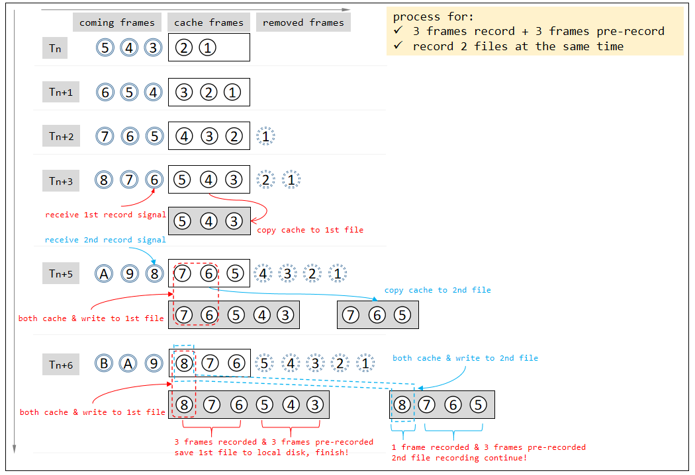

# Summary

`cvedix_record_node` is used to record video and image, save them to local disk after it finished. It's a middle node but works asynchronously, so recording would not block the pipeline.

```
record
 ┣ README.md
 ┣ cvedix_image_record_task.cpp
 ┣ cvedix_image_record_task.h   // image record task
 ┣ cvedix_record_node.cpp
 ┣ cvedix_record_node.h   // record node
 ┣ cvedix_record_task.cpp
 ┣ cvedix_record_task.h   // base class for record task, work async
 ┣ cvedix_video_record_task.cpp
 ┗ cvedix_video_record_task.h   // video record task
```

below is showing how to record video:


