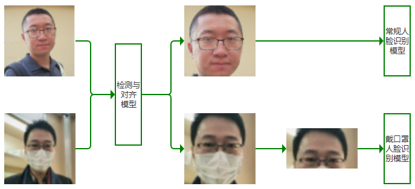
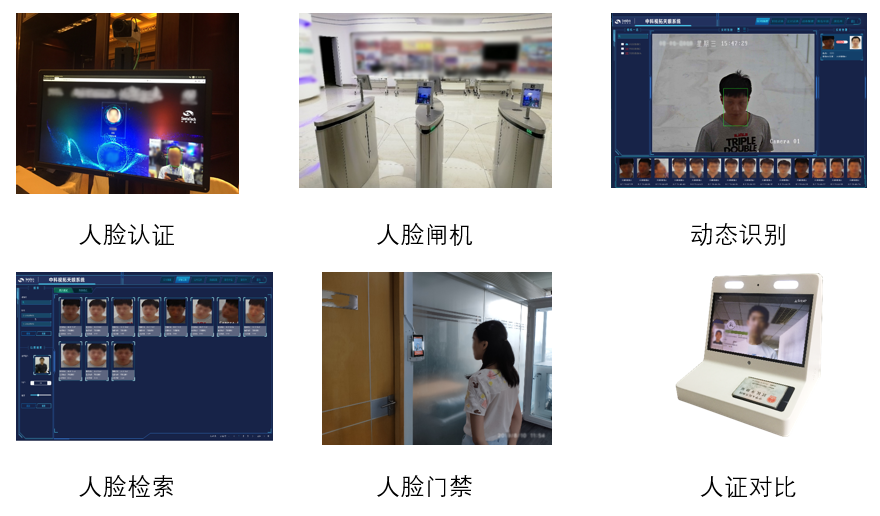
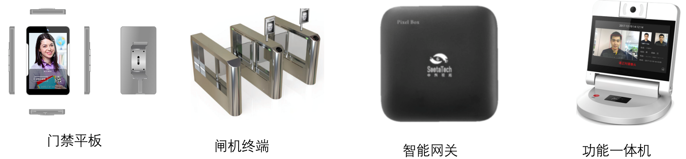

# **SeetaFace6**

[](LICENSE)

## Open Source Modules

`SeetaFace6` is the latest open-source commercial release from SeetaTech (Institute of Computing Technology, Chinese Academy of Sciences). This v6 release is fully synchronized with the commercial version.

<div align=center>

</div>

This release includes the core face recognition components: face detection, landmark localization, and face recognition. It also adds liveness detection, quality assessment, and age/gender estimation. In addition, mask detection and masked face recognition models are provided.

<div align=center>

</div>

We have also open-sourced the latest commercial inference engine **TenniS**. ResNet50 inference speed improved from 8 FPS (SeetaFace2 on i7) to **20 FPS**. The face recognition training dataset has also been significantly expanded to over **100 million images**.

Three model variants are available to meet different application requirements:

| Model Name | Network | Speed (i7-6700) | Speed (RK3399) | Feature Length |
|---|---|---|---|---|
| General Face Recognition | ResNet-50 | 57ms | 300ms | 1024 |
| Masked Face Recognition | ResNet-50 | 34ms | 150ms | 512 |
| General Face Recognition (Light) | Mobile FaceNet | 9ms | 70ms | 512 |

As a capability-compatible upgrade, SeetaFace6 continues to provide robust functionality for a wide range of face recognition applications.

<div align=center>

</div>

The algorithms are suitable for both high-precision server deployments and edge/terminal devices.

<div align=center>

</div>

<div align=center>

</div>

## Building

### Download Source Code

```bash
git clone --recursive https://github.com/SeetaFace6Open/index.git
```

### Build Dependencies

1. **Build Tools**
2. **For Linux**<br>
   GNU Make<br>
   GCC or Clang compiler
3. **For Windows**<br>
   [MSVC](https://visualstudio.microsoft.com/) or MinGW<br>
   [jom](https://wiki.qt.io/Jom)
4. [CMake](http://www.cmake.org/)
5. **CPU Architecture**<br>
   AVX and FMA support [optional] (x86) or NEON (ARM)

### Build Order

**OpenRoleZoo** is a collection of common utilities, **SeetaAuthorize** is the model parsing module, and **TenniS** is the forward computation (inference) framework. Notably, TenniS includes **GPU** computation source code and can be compiled with GPU support. These three modules are the foundation — all SDK modules depend on them. Therefore, you must build **OpenRoleZoo**, **SeetaAuthorize**, and **TenniS** first, then proceed to build the other SDK modules.

### Platform-Specific Build Instructions

#### Linux

```bash
cd ./craft
bash build.linux.x64.sh          # CPU version
bash build.linux.x64_gpu.sh      # GPU version
```

#### Windows

```bash
cd ./craft
build.win.vc14.all.cmd            # CPU version
build.win.vc14.all_gpu.cmd        # GPU version
```

#### Android

- Install NDK build tools (recommended version: **ndk-r16b**)
  - Download NDK from https://developer.android.com/ndk/downloads
  - Set environment variables to export ndk-build

- Build:
  Each module contains `android/jni/Android.mk` and `android/jni/Application.mk` build scripts.
  ```bash
  cd <module>/android/jni
  ndk-build -j4
  ```

#### Other ARM / Cross-Compilation Platforms

Cross-compilation is not directly supported in the current version, but you can refer to [CMake Cross Compile](https://zhuanlan.zhihu.com/p/100367053) for CMake configuration and platform-specific builds.

## Model Downloads

### Baidu Pan

Model files:
- **Part I**: [Download](https://pan.baidu.com/s/1LlXe2-YsUxQMe-MLzhQ2Aw) code: `ngne`
  - Includes: `age_predictor.csta`, `face_landmarker_pts5.csta`, `fas_first.csta`, `pose_estimation.csta`, `eye_state.csta`, `face_landmarker_pts68.csta`, `fas_second.csta`, `quality_lbn.csta`, `face_detector.csta`, `face_recognizer.csta`, `gender_predictor.csta`, `face_landmarker_mask_pts5.csta`, `face_recognizer_mask.csta`, `mask_detector.csta`
- **Part II**: [Download](https://pan.baidu.com/s/1xjciq-lkzEBOZsTfVYAT9g) code: `t6j0`
  - Includes: `face_recognizer_light.csta`

### Dropbox

Model files:
- **Part I**: [Download](https://www.dropbox.com/s/julk1f16riu0dyp/sf6.0_models.zip?dl=0)
  - Includes: `age_predictor.csta`, `face_landmarker_pts5.csta`, `fas_first.csta`, `pose_estimation.csta`, `eye_state.csta`, `face_landmarker_pts68.csta`, `fas_second.csta`, `quality_lbn.csta`, `face_detector.csta`, `face_recognizer.csta`, `gender_predictor.csta`, `face_landmarker_mask_pts5.csta`, `face_recognizer_mask.csta`, `mask_detector.csta`
- **Part II**: [Download](https://www.dropbox.com/s/d296i7efnz5evbx/face_recognizer_light.csta?dl=0)
  - Includes: `face_recognizer_light.csta`

## Getting Started

For basic API usage, refer to the tutorial:
[SeetaFace Getting Started Tutorial](http://leanote.com/blog/post/5e7d6cecab64412ae60016ef) (also available as [source on GitHub](https://github.com/seetafaceengine/SeetaFaceTutorial)).

A complete face recognition demo is available at [example/qt](./example/qt).

## API Documentation

See the module API documentation in [docs](./docs):
- [English](./docs/en) | [Tiếng Việt](./docs/vi)

## Contact

`SeetaFace` open-source edition is free for both commercial and personal use. For additional commercial support, please contact: bd@seetatech.com
